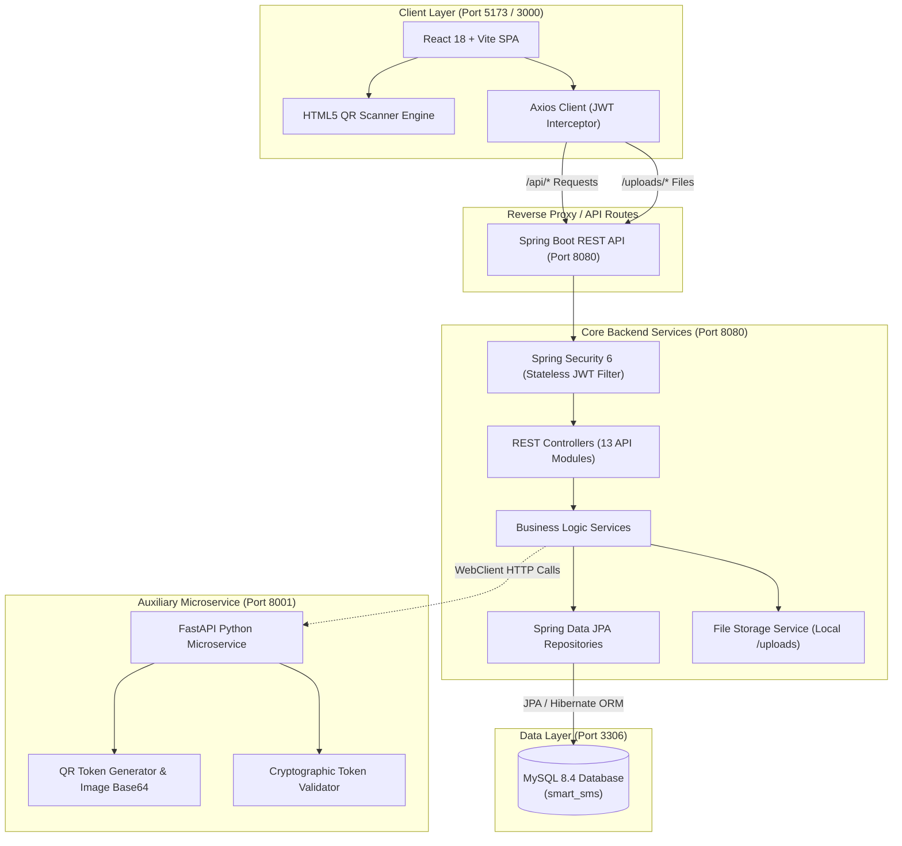
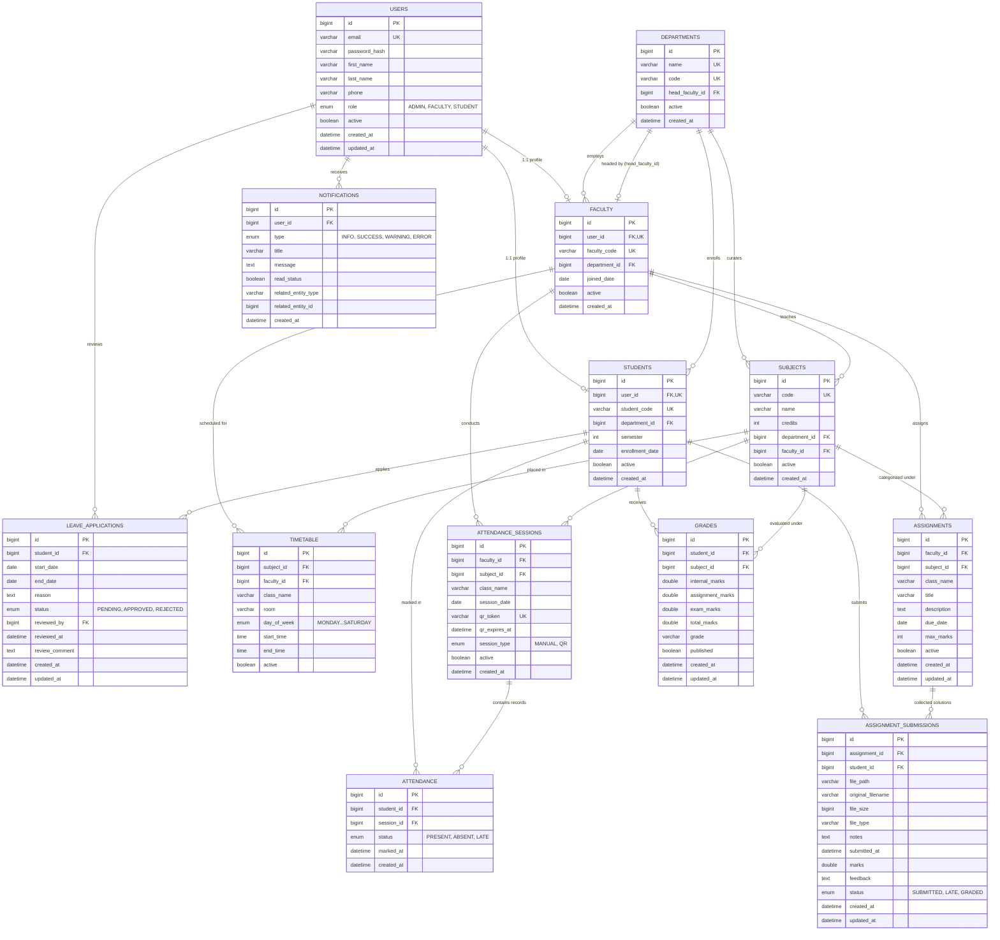
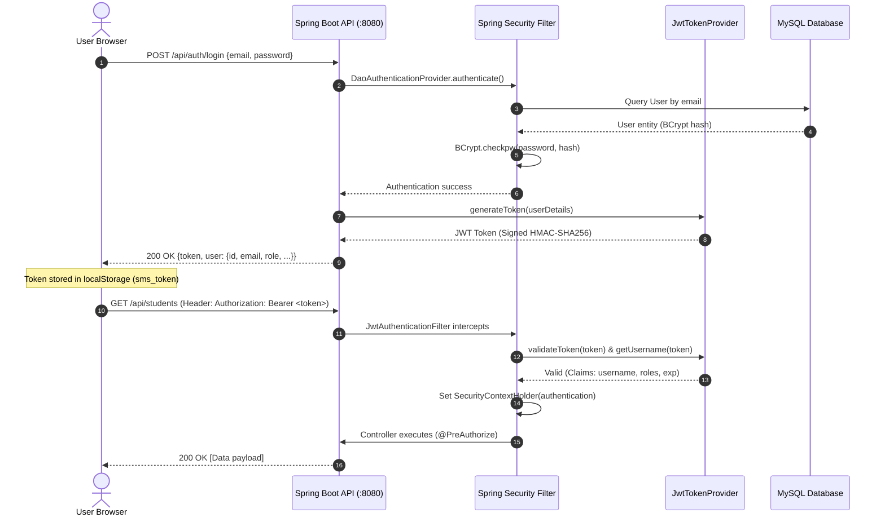
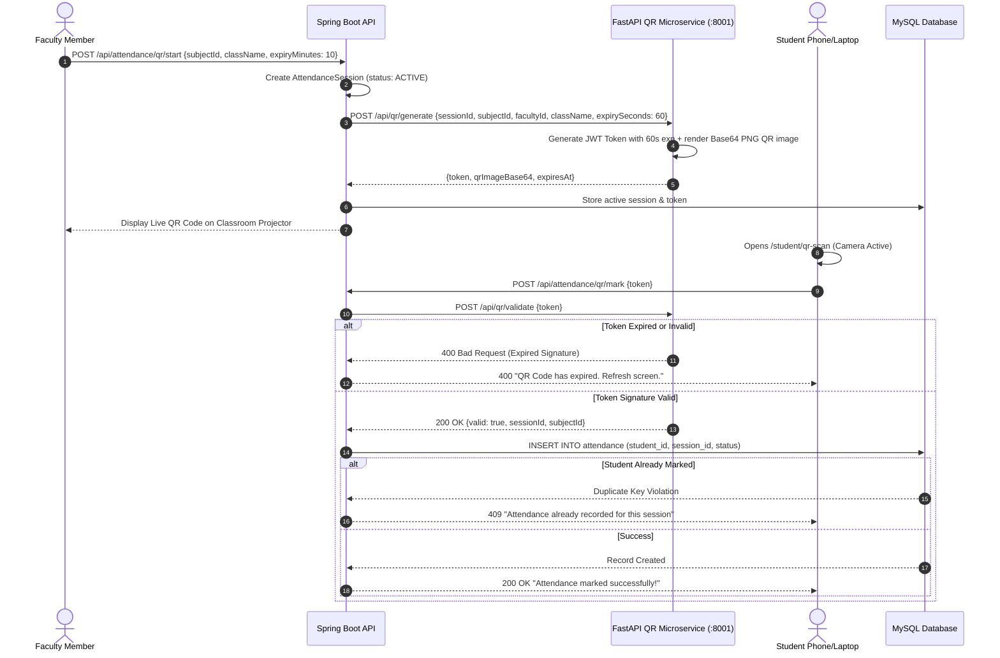

# 🎓 Smart Student & Faculty Management System (Smart-SMS)

An enterprise-grade, full-stack academic lifecycle and management platform engineered with **Spring Boot 3**, **React 18 (Vite)**, **MySQL 8.4**, and a specialized **FastAPI Python Microservice** for high-security, dynamic QR code attendance.

---

## 📑 Table of Contents

- [1. System Overview](#1-system-overview)
- [2. System Architecture & High-Level Map](#2-system-architecture--high-level-map)
- [3. Complete Technology Stack](#3-complete-technology-stack)
- [4. Database Architecture & ER Diagram](#4-database-architecture--er-diagram)
  - [4.1 Visual Entity-Relationship Diagram](#41-visual-entity-relationship-diagram)
  - [4.2 Comprehensive Table Specifications](#42-comprehensive-table-specifications)
- [5. API Routing Map & Endpoints Reference](#5-api-routing-map--endpoints-reference)
  - [5.1 Authentication Endpoints](#51-authentication-endpoints)
  - [5.2 User Management (Admin)](#52-user-management-admin)
  - [5.3 Department & Subject Modules](#53-department--subject-modules)
  - [5.4 Faculty & Student Profiles](#54-faculty--student-profiles)
  - [5.5 Timetable Scheduling](#55-timetable-scheduling)
  - [5.6 Attendance & Dynamic QR System](#56-attendance--dynamic-qr-system)
  - [5.7 Assignments & Submissions](#57-assignments--submissions)
  - [5.8 Grade Calculation & Publishing](#58-grade-calculation--publishing)
  - [5.9 Leave Management](#59-leave-management)
  - [5.10 Real-Time Notifications & Broadcasts](#510-real-time-notifications--broadcasts)
  - [5.11 Institutional Analytics](#511-institutional-analytics)
  - [5.12 Python QR Attendance Microservice](#512-python-qr-attendance-microservice)
- [6. Frontend Module & UI Page Map](#6-frontend-module--ui-page-map)
  - [6.1 Layout & State Management](#61-layout--state-management)
  - [6.2 Role-Based Page Access Matrix](#62-role-based-page-access-matrix)
- [7. Security & Authentication Architecture](#7-security--authentication-architecture)
- [8. Dynamic QR Attendance Mechanism](#8-dynamic-qr-attendance-mechanism)
- [9. Installation & Execution Guide](#9-installation--execution-guide)
  - [9.1 Prerequisites](#91-prerequisites)
  - [9.2 Database Setup](#92-database-setup)
  - [9.3 Python QR Microservice Setup](#93-python-qr-microservice-setup)
  - [9.4 Spring Boot Backend Setup](#94-spring-boot-backend-setup)
  - [9.5 React Frontend Setup](#95-react-frontend-setup)
- [10. Demo Credentials](#10-demo-credentials)
- [11. Troubleshooting & Notes](#11-troubleshooting--notes)

---

## 1. System Overview

The **Smart Student & Faculty Management System** solves administrative overhead, attendance fraud, disjointed grading, and communication delays across educational institutions. 

### Key Capabilities
- 🔐 **Role-Based Access Control (RBAC):** Granular authorization for `ADMIN`, `FACULTY`, and `STUDENT` roles.
- 📱 **Anti-Fraud QR Attendance:** Dynamic, expiring QR tokens signed using HMAC-SHA256 generated via a dedicated FastAPI microservice, scanned live in-browser with HTML5 camera integration.
- 📂 **Academic Submissions & Grading:** Multipart assignment submission with file download controls, automated grade aggregation (Internal + Assignment + Exam), and instant grade publishing.
- 🗓️ **Timetable & Scheduling:** Interactive multi-department class timetable scheduling with conflict checks.
- 📝 **Leave Application Lifecycle:** Student self-service leave requests with faculty/admin multi-stage approval workflows.
- 📊 **Executive Analytics:** High-level KPIs, attendance warning alerts (default `< 75%`), submission tracking, and department metrics visualized with Recharts.
- 🔔 **Multi-Channel Notification System:** Target-specific and campus-wide administrative broadcasts.

---

## 2. System Architecture & High-Level Map

The platform follows a decoupled, service-oriented architecture:



---

## 3. Complete Technology Stack

| Domain | Technology / Library | Version | Role in Project |
| :--- | :--- | :--- | :--- |
| **Frontend UI** | React | `18.2.0` | Declarative component UI library |
| **Build Tool** | Vite | `5.1.6` | Fast HMR dev server and bundler |
| **Routing** | React Router DOM | `6.22.3` | Client-side routing with role-guarded routes |
| **HTTP Client** | Axios | `1.6.8` | REST API communication with automatic JWT injection |
| **QR Scanning** | HTML5-QRCode | `2.3.8` | Real-time web camera stream QR reading |
| **Data Viz** | Recharts | `2.12.3` | Responsive charts for attendance & grade analytics |
| **Iconography** | Lucide React | `0.359.0` | Consistent vector icons |
| **Styling** | Vanilla CSS + CSS Variables | Modern | Custom glassmorphism, responsive themes, modern aesthetics |
| **Backend Core** | Spring Boot | `3.2.3` | Enterprise Java application framework |
| **Language** | Java (Corretto/OpenJDK) | `17 LTS` | Core programming language |
| **Security** | Spring Security + JJWT | `0.11.5` | Stateless authentication, RBAC, BCrypt passwords |
| **Data Access** | Spring Data JPA / Hibernate | `3.2.3` | Object-Relational Mapping (ORM) and data abstraction |
| **API Docs** | SpringDoc OpenAPI (Swagger UI)| `2.3.0` | Auto-generated interactive API documentation |
| **HTTP WebClient** | Spring WebFlux | `3.2.3` | Non-blocking HTTP client calling the Python QR microservice |
| **File I/O** | Apache Commons IO / Lang3 | `2.15.1` | Multipart file management and input sanitization |
| **Microservice** | Python FastAPI + Uvicorn | `1.0.0` | High-speed dynamic QR token generation and validation |
| **QR Engine** | Python `qrcode` + `Pillow` | Latest | Generation of base64 PNG QR code matrices |
| **Database** | MySQL Server (Portable/Standard) | `8.0 / 8.4` | Relational database with InnoDB engine and ACID compliance |

---

## 4. Database Architecture & ER Diagram

The database schema (`smart_sms`) is normalized to 3NF, utilizing foreign keys with `ON DELETE CASCADE` or `ON DELETE SET NULL` constraints to ensure referential integrity.

### 4.1 Visual Entity-Relationship Diagram



### 4.2 Comprehensive Table Specifications

#### 1. `users`
- Central authentication and credential store for all actors.
- **Constraints:** `email` UNIQUE, `role` in `('STUDENT', 'FACULTY', 'ADMIN')`.
- **Indexes:** `idx_users_email` on `email`, `idx_users_role` on `role`.

#### 2. `departments`
- Academic branches (e.g., Computer Science, Information Technology).
- **Constraints:** `name` UNIQUE, `code` UNIQUE.
- **Foreign Keys:** `head_faculty_id` references `faculty(id)` (`ON DELETE SET NULL`).

#### 3. `faculty`
- Profiles for faculty members linked 1:1 with `users`.
- **Constraints:** `user_id` UNIQUE, `faculty_code` UNIQUE.
- **Foreign Keys:** `user_id` references `users(id)`, `department_id` references `departments(id)`.

#### 4. `students`
- Student academic profiles linked 1:1 with `users`.
- **Constraints:** `user_id` UNIQUE, `student_code` UNIQUE.
- **Foreign Keys:** `user_id` references `users(id)`, `department_id` references `departments(id)`.

#### 5. `subjects`
- Individual courses offered by departments.
- **Constraints:** `code` UNIQUE.
- **Foreign Keys:** `department_id` references `departments(id)`, `faculty_id` references `faculty(id)` (`ON DELETE SET NULL`).

#### 6. `timetable`
- Weekly schedule slots for class sessions.
- **Foreign Keys:** `subject_id` references `subjects(id)`, `faculty_id` references `faculty(id)`.
- **Indexes:** `idx_tt_faculty`, `idx_tt_class`, `idx_tt_day`.

#### 7. `attendance_sessions`
- Represents a teaching session where attendance is marked (either via manual entry or dynamically refreshed QR).
- **Foreign Keys:** `faculty_id` references `faculty(id)`, `subject_id` references `subjects(id)`.
- **Fields:** `qr_token`, `qr_expires_at`, `session_type` (`'MANUAL'`, `'QR'`).

#### 8. `attendance`
- Individual student participation records per session.
- **Constraints:** `uk_student_session` UNIQUE (`student_id`, `session_id`) preventing double-marking.
- **Foreign Keys:** `student_id` references `students(id)`, `session_id` references `attendance_sessions(id)`.

#### 9. `assignments`
- Homework tasks, lab reports, and projects issued by faculty.
- **Foreign Keys:** `faculty_id` references `faculty(id)`, `subject_id` references `subjects(id)`.

#### 10. `assignment_submissions`
- Uploaded student work, file paths, marks, and feedback.
- **Constraints:** `uk_assignment_student` UNIQUE (`assignment_id`, `student_id`).
- **Foreign Keys:** `assignment_id` references `assignments(id)`, `student_id` references `students(id)`.

#### 11. `leave_applications`
- Student leave requests with dates, reasons, and review auditing.
- **Foreign Keys:** `student_id` references `students(id)`, `reviewed_by` references `users(id)`.

#### 12. `grades`
- Semester grading table with composite marks breakdown.
- **Constraints:** `uk_student_subject` UNIQUE (`student_id`, `subject_id`).
- **Calculation:** `total_marks = internal_marks + assignment_marks + exam_marks`. Letter grades: `A+`, `A`, `B`, `C`, `D`, `F`.

#### 13. `notifications`
- In-app notification messages sent to users.
- **Indexes:** `idx_notif_user`, `idx_notif_read`, `idx_notif_entity`.

---

## 5. API Routing Map & Endpoints Reference

All Spring Boot REST endpoints are prefixed with `/api`. Responses adhere to the standard JSON structure:
```json
{
  "success": true,
  "message": "Operation description",
  "data": { ... },
  "timestamp": "2026-09-29T12:00:00"
}
```

### 5.1 Authentication Endpoints (`/api/auth`)
| Method | Endpoint | Access | Description |
| :--- | :--- | :--- | :--- |
| `POST` | `/api/auth/login` | Public | Authenticates user; returns JWT token and profile data |
| `GET` | `/api/auth/me` | Authenticated | Fetches profile of the currently logged-in user |
| `POST` | `/api/auth/logout` | Authenticated | Clears client-side session tokens |
| `POST` | `/api/auth/change-password` | Authenticated | Updates password for authenticated account |

### 5.2 User Management (`/api/users`)
| Method | Endpoint | Access | Description |
| :--- | :--- | :--- | :--- |
| `GET` | `/api/users` | Admin | Paginated user list with filters (`role`, `search`, `active`) |
| `POST` | `/api/users` | Admin | Creates student or faculty account with automatic profile linking |
| `PUT` | `/api/users/{id}/toggle-active`| Admin | Activates/deactivates user access |

### 5.3 Department & Subject Modules
| Method | Endpoint | Access | Description |
| :--- | :--- | :--- | :--- |
| `GET` | `/api/departments` | Authenticated | Lists all active departments |
| `GET` | `/api/departments/{id}` | Authenticated | Returns department details |
| `POST` | `/api/departments` | Admin | Creates a new department |
| `PUT` | `/api/departments/{id}` | Admin | Updates department metadata |
| `PUT` | `/api/departments/{id}/toggle-active` | Admin | Safe deactivation check (verifies no active students/faculty) |
| `GET` | `/api/subjects` | Authenticated | Lists subjects (filterable by `department`, `faculty`) |
| `GET` | `/api/subjects/{id}` | Authenticated | Returns subject details |
| `POST` | `/api/subjects` | Admin | Creates a new subject |
| `PUT` | `/api/subjects/{id}` | Admin | Updates subject details and assigned faculty |
| `PUT` | `/api/subjects/{id}/toggle-active` | Admin | Safe deactivation check (verifies no active timetable) |

### 5.4 Faculty & Student Profiles
| Method | Endpoint | Access | Description |
| :--- | :--- | :--- | :--- |
| `GET` | `/api/faculty` | Admin | Lists faculty directory |
| `GET` | `/api/faculty/{id}` | Admin, Faculty | Fetches faculty member details |
| `GET` | `/api/faculty/me` | Faculty | Fetches own faculty profile |
| `PUT` | `/api/faculty/{id}` | Admin | Updates faculty personal details / department |
| `PUT` | `/api/faculty/{id}/toggle-active` | Admin | Toggles active status |
| `GET` | `/api/students` | Admin, Faculty | Lists students (filterable by `search`, `department`, `semester`)|
| `GET` | `/api/students/{id}` | Admin, Faculty, Self | Returns student details |
| `GET` | `/api/students/me` | Student | Fetches own student profile |
| `PUT` | `/api/students/{id}` | Admin | Updates student profile details |
| `PUT` | `/api/students/{id}/toggle-active`| Admin | Toggles student active status |

### 5.5 Timetable Scheduling (`/api/timetable`)
| Method | Endpoint | Access | Description |
| :--- | :--- | :--- | :--- |
| `GET` | `/api/timetable` | Authenticated | Lists timetable (filterable by `className`, `facultyId`) |
| `GET` | `/api/timetable/my` | Authenticated | Returns personal timetable (Faculty schedule or Student class) |
| `POST` | `/api/timetable` | Admin | Creates a timetable entry |
| `PUT` | `/api/timetable/{id}` | Admin | Updates timetable slot |
| `DELETE` | `/api/timetable/{id}` | Admin | Deletes timetable slot |

### 5.6 Attendance & Dynamic QR System (`/api/attendance`)
| Method | Endpoint | Access | Description |
| :--- | :--- | :--- | :--- |
| `POST` | `/api/attendance/sessions` | Faculty | Creates a manual attendance session |
| `POST` | `/api/attendance/sessions/{sessionId}/mark`| Faculty | Batch marks attendance records for a session |
| `POST` | `/api/attendance/mark-manual` | Faculty | One-shot endpoint creating session and recording student statuses |
| `POST` | `/api/attendance/qr/start` or `/qr-session` | Faculty | Generates an expiring QR code session via Python microservice |
| `GET` | `/api/attendance/qr/{sessionId}/status` | Faculty | Real-time attendee counter for active QR session |
| `POST` | `/api/attendance/qr/mark` or `/mark-qr` | Student | Validates QR token and logs student attendance |
| `GET` | `/api/attendance/my` | Student | Returns student's personal attendance percentages & stats |
| `GET` | `/api/attendance/student/{studentId}` | Authenticated | Returns attendance summary for specified student |
| `GET` | `/api/attendance/admin` | Admin | Multi-filter paginated attendance audit log |

### 5.7 Assignments & Submissions (`/api/assignments`)
| Method | Endpoint | Access | Description |
| :--- | :--- | :--- | :--- |
| `GET` | `/api/assignments` | Authenticated | Lists assignments (filterable by `subjectId`, `facultyId`, `className`) |
| `GET` | `/api/assignments/{id}` | Authenticated | Fetches assignment details |
| `POST` | `/api/assignments` | Faculty | Publishes a new assignment |
| `PUT` | `/api/assignments/{id}` | Faculty | Updates an existing assignment |
| `PUT` | `/api/assignments/{id}/toggle-active` | Faculty, Admin | Toggles assignment active status |
| `POST` | `/api/assignments/{id}/submit` | Student | Multipart file upload and notes submission |
| `GET` | `/api/assignments/my` | Student | Returns list of student's own submissions |
| `GET` | `/api/assignments/{id}/submissions` | Faculty, Admin | View all student submissions for an assignment |
| `PUT` | `/api/assignments/submissions/{id}/grade`| Faculty | Grades submission with marks and written feedback |
| `GET` | `/api/assignments/submissions/{id}/download` | Authorized | Secure file download (authorized for student, owner faculty, admin) |

### 5.8 Grade Management (`/api/grades`)
| Method | Endpoint | Access | Description |
| :--- | :--- | :--- | :--- |
| `GET` | `/api/grades` | Faculty, Admin | View subject grade book |
| `GET` | `/api/grades/my` | Student | View published grades for logged-in student |
| `GET` | `/api/grades/student/{studentId}`| Faculty, Admin | View grade card for a specific student |
| `POST` | `/api/grades` | Faculty | Save or update student grades (Internal, Assignment, Exam) |
| `PUT` | `/api/grades/{id}/publish` | Faculty, Admin | Publishes grade to make it visible to student |
| `POST` | `/api/grades/bulk` | Faculty | Bulk grade upload / entry |

### 5.9 Leave Applications (`/api/leaves`)
| Method | Endpoint | Access | Description |
| :--- | :--- | :--- | :--- |
| `POST` | `/api/leaves` | Student | Submits new leave application |
| `GET` | `/api/leaves` | Authenticated | Lists leaves (Students see own; Faculty/Admin see department/all) |
| `GET` | `/api/leaves/{id}` | Authenticated | Returns leave details |
| `PUT` | `/api/leaves/{id}/review` | Faculty, Admin | Approves or rejects leave with review comments |

### 5.10 Real-Time Notifications (`/api/notifications`)
| Method | Endpoint | Access | Description |
| :--- | :--- | :--- | :--- |
| `GET` | `/api/notifications` | Authenticated | Paginated notifications for logged-in user |
| `GET` | `/api/notifications/unread-count` | Authenticated | Count of unread notifications |
| `PUT` | `/api/notifications/{id}/read` | Authenticated | Marks a specific notification as read |
| `PUT` | `/api/notifications/read-all` | Authenticated | Marks all notifications as read |
| `POST` | `/api/notifications` | Admin | Broadcasts notification to a specific user or all users |
| `DELETE` | `/api/notifications/{id}` | Admin | Deletes notification |

### 5.11 Institutional Analytics (`/api/analytics`)
| Method | Endpoint | Access | Description |
| :--- | :--- | :--- | :--- |
| `GET` | `/api/analytics/dashboard` | Admin | System counts, active users, departments, and health metrics |
| `GET` | `/api/analytics/attendance` | Admin, Faculty | Attendance percentages, defaulter counts (<75%), trends |
| `GET` | `/api/analytics/assignments` | Admin, Faculty | Submission rates, grading progress, overdue ratios |
| `GET` | `/api/analytics/grades` | Admin, Faculty | Grade distributions (A+, A, B, etc.) and average marks |
| `GET` | `/api/analytics/students` | Admin | Enrollment distributions by department and semester |

### 5.12 Python QR Microservice (`http://localhost:8001`)
| Method | Endpoint | Description |
| :--- | :--- | :--- |
| `GET` | `/health` | Microservice health check probe |
| `POST` | `/api/qr/generate` | Generates HS256 signed token, expiration timestamp, and Base64 QR code image |
| `POST` | `/api/qr/validate` | Validates token authenticity, signature, and expiration |
| `GET` | `/api/qr/validate/{token}` | URL-based token validator |

---

## 6. Frontend Module & UI Page Map

### 6.1 Layout & State Management
- **`AuthContext.jsx`:** Stores authenticated user profile, JWT token in `localStorage`, and handles automatic token refreshing/invalidation on HTTP `401`.
- **`Navbar.jsx`:** Displays university branding, user role pill, quick notification dropdown with unread badge, and profile quick menu.
- **`Sidebar.jsx`:** Dynamically renders navigation links matching the authenticated user's role.
- **`ProtectedRoute.jsx`:** Evaluates authentication state and allowed roles before rendering route content, redirecting unauthorized attempts to `/dashboard` or `/login`.

### 6.2 Role-Based Page Access Matrix

```
┌───────────────────────────────┬───────────────────────────────┬───────────────────────┐
│ ADMIN                         │ FACULTY                       │ STUDENT               │
├───────────────────────────────┼───────────────────────────────┼───────────────────────┤
│ • /dashboard                  │ • /dashboard                  │ • /dashboard          │
│ • /admin/users                │ • /faculty/attendance         │ • /student/attendance │
│ • /admin/departments          │ • /faculty/qr-session         │ • /student/qr-scan    │
│ • /admin/subjects             │ • /faculty/assignments        │ • /student/assignments│
│ • /admin/timetable            │ • /faculty/grades             │ • /student/grades     │
│ • /admin/analytics            │ • /faculty/leaves             │ • /student/leaves     │
│ • /profile                    │ • /faculty/timetable          │ • /student/timetable  │
│ • /notifications              │ • /profile                    │ • /profile            │
│                               │ • /notifications              │ • /notifications      │
└───────────────────────────────┴───────────────────────────────┴───────────────────────┘
```

---

## 7. Security & Authentication Architecture



---

## 8. Dynamic QR Attendance Mechanism

To eliminate "buddy punching" (students sharing static QR images or attendance links), the system utilizes dynamic, time-limited cryptographic tokens:



---

## 9. Installation & Execution Guide

### 9.1 Prerequisites
- **Java Development Kit (JDK):** Version 17 LTS or higher
- **Build Tool:** Apache Maven 3.8+
- **Node.js:** Version 18.x or 20.x LTS with `npm`
- **Python:** Version 3.9+ with `pip`
- **Database:** MySQL Server 8.0 / 8.4 (or use the included portable MySQL binaries)

---

### 9.2 Database Setup

#### Option A: Using Included Portable MySQL Server
```powershell
# In project root:
.\mysql_portable\mysql-8.4.9-winx64\bin\mysqld.exe --console
```
The database runs on `localhost:3306` with default user `root` and empty password `""`.

#### Option B: Using Installed MySQL Service
1. Start your local MySQL service.
2. Create the database and seed tables:
   ```bash
   mysql -u root -p < database/schema/schema.sql
   mysql -u root -p < database/seed/seed.sql
   ```

---

### 9.3 Python QR Microservice Setup

1. Open a new terminal in the `qr-service` directory:
   ```bash
   cd qr-service
   ```
2. Create and activate a Python virtual environment:
   ```bash
   # Windows:
   python -m venv venv
   .\venv\Scripts\activate

   # Linux / macOS:
   python3 -m venv venv
   source venv/bin/activate
   ```
3. Install dependencies:
   ```bash
   pip install -r requirements.txt
   ```
4. Start the FastAPI microservice on port **8001**:
   ```bash
   uvicorn main:app --port 8001 --reload
   ```
   *Health Check:* [http://localhost:8001/health](http://localhost:8001/health)

---

### 9.4 Spring Boot Backend Setup

1. Open a terminal in the `backend` directory:
   ```bash
   cd backend
   ```
2. Verify database credentials in `src/main/resources/application.properties`:
   ```properties
   spring.datasource.url=jdbc:mysql://localhost:3306/smart_sms?useSSL=false&serverTimezone=UTC&allowPublicKeyRetrieval=true
   spring.datasource.username=root
   spring.datasource.password=
   ```
3. Compile and launch the application:
   ```bash
   mvn clean spring-boot:run
   ```
   *API Base:* [http://localhost:8080](http://localhost:8080)  
   *Interactive Swagger Documentation:* [http://localhost:8080/swagger-ui/index.html](http://localhost:8080/swagger-ui/index.html)  
   *Actuator Health Check:* [http://localhost:8080/actuator/health](http://localhost:8080/actuator/health)

---

### 9.5 React Frontend Setup

1. Open a terminal in the `frontend` directory:
   ```bash
   cd frontend
   npm install
   ```
2. Launch the Vite development server:
   ```bash
   npm run dev
   ```
   > **Note for Windows users:** If your path contains ampersands (`&`), run Vite directly via Node:
   > ```powershell
   > node .\node_modules\vite\bin\vite.js
   > ```
3. Open your browser and navigate to:  
   **[http://localhost:5173](http://localhost:5173)**

---

## 10. Demo Credentials

The pre-seeded database contains realistic accounts across all three organizational tiers:

| Role | Username / Email | Password | Access Rights & Purpose |
| :--- | :--- | :--- | :--- |
| 🛡️ **Administrator** | `admin@sms.edu` | `Admin@123` | Full administrative control: user provisioning, department & subject setup, timetable scheduling, campus-wide notifications, and executive analytics. |
| 👨‍🏫 **Faculty Member** | `priya.sharma@sms.edu` | `Faculty@123` | Department: Computer Science (CSE). Can generate QR attendance sessions, issue assignments, evaluate and download student files, record grades, and approve leave requests. |
| 👨‍🏫 **Faculty Member** | `rajan.verma@sms.edu` | `Faculty@123` | Department: Computer Science (CSE). Second faculty account for timetable and subject testing. |
| 🎓 **Student** | `arjun.kumar@sms.edu` | `Student@123` | Department: CSE (Semester 7). Can scan live QR codes, submit coursework, monitor attendance percentages, view grades, and request leaves. |
| 🎓 **Student** | `meera.patel@sms.edu` | `Student@123` | Department: CSE (Semester 7). Additional student account. |

*(Quick-login buttons are also available directly on the login screen for one-click access).*

---

## 11. Troubleshooting & Notes

- **Port Conflicts:** Ensure ports `3306` (MySQL), `8080` (Spring Boot), `5173` (Vite Frontend), and `8001` (Python QR Microservice) are free before launching.
- **Uploaded Files:** Files uploaded by students for assignments are stored in `./uploads/assignments/`. Ensure the backend process has write permissions for this folder.
- **CORS Errors:** In `application.properties`, `cors.allowed.origins` is configured to `http://localhost:5173`. If running the frontend on a different port or domain, update this property accordingly.
- **QR Code Expiration:** The QR microservice tokens default to 60-second expiration. Ensure the system clock across your host machine is synchronized.
