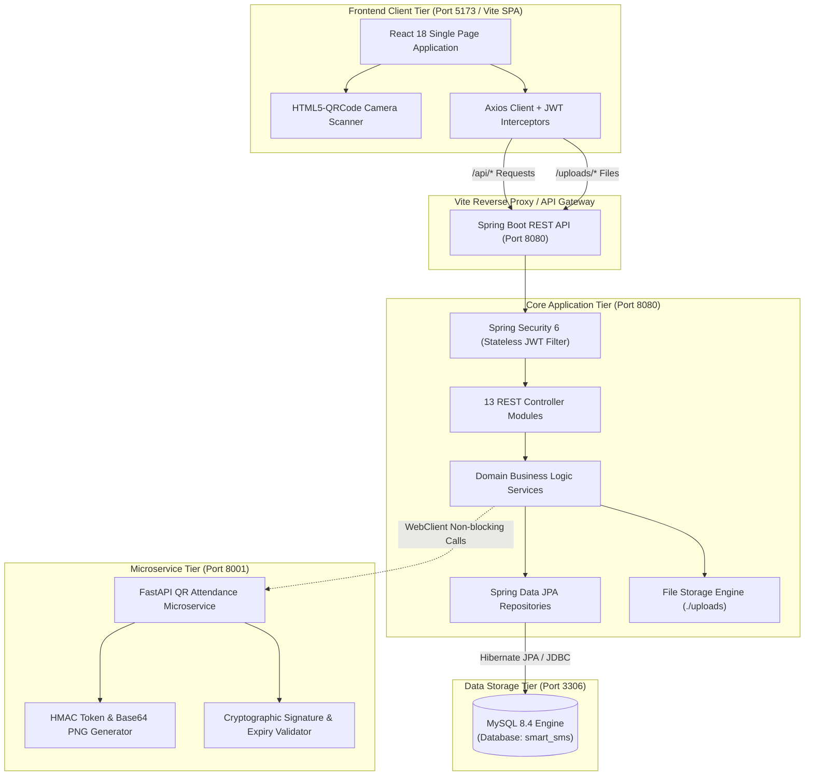
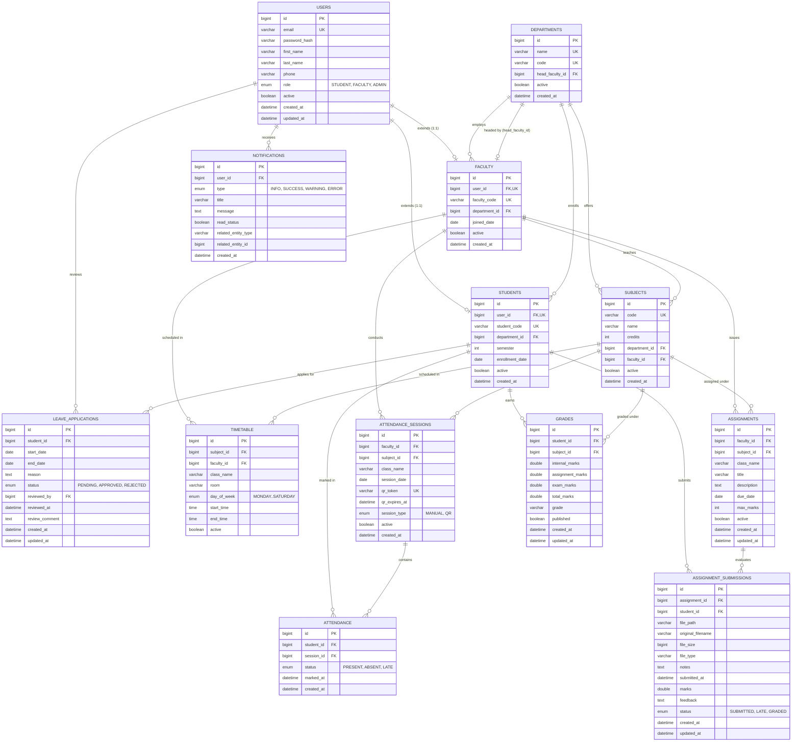
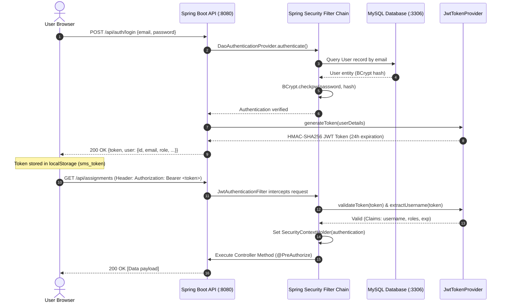
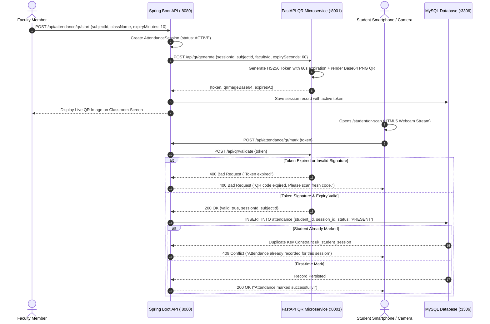

# 🎓 Smart Student & Faculty Management System (Smart-SMS)

An enterprise-grade, full-stack academic lifecycle and campus operations platform built with **Spring Boot 3 (Java 17)**, **React 18 (Vite SPA)**, **MySQL 8.4**, and a specialized **FastAPI Python Microservice** for high-security, dynamic QR code attendance verification.

---

## 📑 Table of Contents

- [1. Executive System Overview](#1-executive-system-overview)
- [2. System Architecture & Component Topology](#2-system-architecture--component-topology)
- [3. Complete Technology Stack Reference](#3-complete-technology-stack-reference)
- [4. Database Architecture & ER Diagram](#4-database-architecture--er-diagram)
  - [4.1 Visual Entity-Relationship Diagram](#41-visual-entity-relationship-diagram)
  - [4.2 Comprehensive Schema Specifications](#42-comprehensive-schema-specifications)
- [5. API Routing Map & Endpoints Reference](#5-api-routing-map--endpoints-reference)
  - [5.1 Authentication Module (`/api/auth`)](#51-authentication-module-apiauth)
  - [5.2 User Management Module (`/api/users`)](#52-user-management-module-apiusers)
  - [5.3 Department Module (`/api/departments`)](#53-department-module-apidepartments)
  - [5.4 Subject Module (`/api/subjects`)](#54-subject-module-apisubjects)
  - [5.5 Faculty Module (`/api/faculty`)](#55-faculty-module-apifaculty)
  - [5.6 Student Module (`/api/students`)](#56-student-module-apistudents)
  - [5.7 Timetable Module (`/api/timetable`)](#57-timetable-module-apitimetable)
  - [5.8 Attendance & Dynamic QR System (`/api/attendance`)](#58-attendance--dynamic-qr-system-apiattendance)
  - [5.9 Assignment & Submission Subsystem (`/api/assignments`)](#59-assignment--submission-subsystem-apiassignments)
  - [5.10 Gradebook & Evaluation Subsystem (`/api/grades`)](#510-gradebook--evaluation-subsystem-apigrades)
  - [5.11 Leave Lifecycle Subsystem (`/api/leaves`)](#511-leave-lifecycle-subsystem-apileaves)
  - [5.12 Notification & Broadcast Subsystem (`/api/notifications`)](#512-notification--broadcast-subsystem-apinotifications)
  - [5.13 Institutional Analytics Subsystem (`/api/analytics`)](#513-institutional-analytics-subsystem-apianalytics)
  - [5.14 Python FastAPI Dynamic QR Microservice (`:8001`)](#514-python-fastapi-dynamic-qr-microservice-8001)
- [6. Frontend Module & UI Page Map](#6-frontend-module--ui-page-map)
  - [6.1 Layout, Contexts & Interceptors](#61-layout-contexts--interceptors)
  - [6.2 Role-Based Access Matrix](#62-role-based-access-matrix)
- [7. Security & Authentication Architecture](#7-security--authentication-architecture)
- [8. Dynamic QR Attendance Mechanism](#8-dynamic-qr-attendance-mechanism)
- [9. Installation & Execution Guide](#9-installation--execution-guide)
  - [9.1 Prerequisites](#91-prerequisites)
  - [9.2 Database Setup](#92-database-setup)
  - [9.3 Python QR Attendance Microservice Setup](#93-python-qr-attendance-microservice-setup)
  - [9.4 Spring Boot Backend Setup](#94-spring-boot-backend-setup)
  - [9.5 React Frontend Setup](#95-react-frontend-setup)
- [10. Demo Credentials & Test Accounts](#10-demo-credentials--test-accounts)
- [11. Production Deployment & Operational Notes](#11-production-deployment--operational-notes)

---

## 1. Executive System Overview

The **Smart Student & Faculty Management System (Smart-SMS)** eliminates administrative fragmentation, attendance fraud, disjointed grading pipelines, and communication gaps across academic institutions. 

### Core Capabilities
- 🔐 **Granular Role-Based Access Control (RBAC):** Three distinct organizational roles (`ADMIN`, `FACULTY`, `STUDENT`) governed by Spring Security stateless JWT filtering and client-side route guards.
- 📱 **Anti-Fraud Dynamic QR Attendance:** Rotating, cryptographically signed QR tokens generated via a dedicated FastAPI microservice with in-browser HTML5 camera scanning and duplicate detection.
- 📂 **Coursework & File Submission Subsystem:** Multipart assignment submission supporting documents (`pdf`, `doc`, `docx`, `zip`, `txt`, `images`), secure download authorization, and faculty grading workflows.
- 🗓️ **Academic Scheduling Engine:** Multi-department timetable scheduler with day/slot conflict detection and faculty workload views.
- 📝 **Leave Application Workflow:** Multi-stage self-service leave requests with administrative review and approval histories.
- 📊 **Executive Analytics & KPI Dashboards:** Interactive metrics visualized using Recharts, including attendance warning defaulters (< 75%), grade distributions, department ratios, and coursework completion rates.
- 🔔 **Multi-Channel Notification Broadcasts:** Campus-wide announcements and targeted user notifications with unread counts and read receipt tracking.

---

## 2. System Architecture & Component Topology



---

## 3. Complete Technology Stack Reference

| Layer / Domain | Technology | Version | Purpose / Architectural Responsibility |
| :--- | :--- | :--- | :--- |
| **Backend Framework** | Spring Boot | `3.2.3` | Core microservice framework, REST controllers, DI container |
| **Language Runtime** | Java JDK | `17 LTS` | Backend execution environment |
| **Persistence / ORM** | Spring Data JPA (Hibernate) | `6.4.4` | Relational data persistence, schema validation, entity mappings |
| **Security Layer** | Spring Security & JJWT | `6.2.2` / `0.11.5` | Stateless authentication, BCrypt hashing, JWT authorization |
| **Microservice Client** | Spring WebFlux (WebClient) | `3.2.3` | Non-blocking HTTP integration with Python microservice |
| **API Documentation** | Springdoc OpenAPI (Swagger) | `2.3.0` | Interactive REST documentation and sandbox at `/swagger-ui/index.html` |
| **Microservice Backend** | Python FastAPI & Uvicorn | `0.110.0` / `0.28.0` | High-performance dynamic QR generation & cryptographic validation |
| **QR Generation Engine** | Python `qrcode` & `Pillow` | `7.4.2` / `10.2.0` | Base64 PNG image rendering of signed payload tokens |
| **Database Engine** | MySQL Server / MariaDB | `8.4.9` | Relational storage (`smart_sms`), indexed foreign keys, constraints |
| **Frontend Framework** | React | `18.2.0` | Component-driven declarative UI architecture |
| **Build Tool & Bundler** | Vite | `5.1.6` | Fast ESM build system, HMR dev server, reverse proxy |
| **Routing Engine** | React Router DOM | `6.22.3` | Client-side routing with role-guarded `ProtectedRoute` wrappers |
| **HTTP Interceptor** | Axios | `1.6.8` | REST client with bearer token injection & auto payload unwrapping |
| **QR Scanning Engine** | HTML5-QRCode | `2.3.8` | Browser webcam stream processing and QR token decoding |
| **Data Visualization** | Recharts | `2.12.3` | Responsive analytics, pie charts, bar charts, line graphs |
| **Iconography** | Lucide React | `0.359.0` | Clean vector iconography across dashboards and navigation |

---

## 4. Database Architecture & ER Diagram

### 4.1 Visual Entity-Relationship Diagram



### 4.2 Comprehensive Schema Specifications

1. **`users`:** Unified table for authentication identities and system-wide roles (`ADMIN`, `FACULTY`, `STUDENT`).
2. **`departments`:** Academic departments (CSE, ECE, MECH, etc.) linked to faculty department heads.
3. **`faculty`:** Extends `users` table via `user_id` 1:1, specifying `faculty_code` and `department_id`.
4. **`students`:** Extends `users` table via `user_id` 1:1, specifying `student_code`, `department_id`, and `semester`.
5. **`subjects`:** Academic courses with unique `code`, `credits`, department parent, and assigned faculty teacher.
6. **`timetable`:** Class scheduling matrix mapping subject, faculty, class name, room number, day of the week, start time, and end time.
7. **`attendance_sessions`:** Classroom session records supporting either manual entry or dynamic time-limited QR attendance.
8. **`attendance`:** Individual student attendance records per session with unique constraint `(student_id, session_id)` ensuring single submissions.
9. **`assignments`:** Course assignments issued by faculty with titles, instructions, due dates, and max marks.
10. **`assignment_submissions`:** Student assignment submissions with uploaded file metadata, submission timestamp, and faculty grading remarks.
11. **`leave_applications`:** Student self-service leave requests with date spans, reasons, and faculty/admin review timestamps.
12. **`grades`:** Academic gradebook tracking internal, assignment, and exam breakdowns, computed overall grade, and publication state.
13. **`notifications`:** User notification stream tracking broadcast announcements, read status, and contextual entity links.

---

## 5. API Routing Map & Endpoints Reference

### 5.1 Authentication Module (`/api/auth`)
| Method | Endpoint | Authorization | Description |
| :--- | :--- | :--- | :--- |
| `POST` | `/api/auth/login` | Public | Authenticates credentials; returns signed JWT token + user profile |
| `GET` | `/api/auth/me` | Authenticated | Retrieves profile of currently authenticated user |
| `POST` | `/api/auth/logout` | Authenticated | Client-side session invalidation acknowledgment |
| `POST` | `/api/auth/change-password` | Authenticated | Updates current user password using BCrypt hashing |

### 5.2 User Management Module (`/api/users`)
| Method | Endpoint | Authorization | Description |
| :--- | :--- | :--- | :--- |
| `GET` | `/api/users` | Admin | Returns paginated list of users with search, role, and active status filters |
| `POST` | `/api/users` | Admin | Creates new Student or Faculty user with auto-generated code and profile |
| `PUT` | `/api/users/{id}/toggle-active` | Admin | Activates or deactivates user profile (`?role=STUDENT` or `?role=FACULTY`) |

### 5.3 Department Module (`/api/departments`)
| Method | Endpoint | Authorization | Description |
| :--- | :--- | :--- | :--- |
| `GET` | `/api/departments` | Authenticated | Returns all active academic departments |
| `GET` | `/api/departments/{id}` | Authenticated | Returns department details by ID |
| `POST` | `/api/departments` | Admin | Registers new academic department |
| `PUT` | `/api/departments/{id}` | Admin | Modifies department title or code |
| `PUT` | `/api/departments/{id}/toggle-active`| Admin | Deactivates department (with active student/faculty safety checks) |

### 5.4 Subject Module (`/api/subjects`)
| Method | Endpoint | Authorization | Description |
| :--- | :--- | :--- | :--- |
| `GET` | `/api/subjects` | Authenticated | Returns subjects with optional `?department=` and `?faculty=` filtering |
| `GET` | `/api/subjects/{id}` | Authenticated | Returns single subject profile |
| `POST` | `/api/subjects` | Admin | Adds subject with credits, department, and faculty assignment |
| `PUT` | `/api/subjects/{id}` | Admin | Modifies subject credits, title, code, or assigned instructor |
| `PUT` | `/api/subjects/{id}/toggle-active` | Admin | Toggles subject active state (guards against active timetable entries) |

### 5.5 Faculty Module (`/api/faculty`)
| Method | Endpoint | Authorization | Description |
| :--- | :--- | :--- | :--- |
| `GET` | `/api/faculty` | Admin | Paginated list of faculty members with search and department filtering |
| `GET` | `/api/faculty/{id}` | Admin, Faculty | Retrieves faculty profile by ID |
| `GET` | `/api/faculty/me` | Faculty | Returns current authenticated faculty profile |
| `PUT` | `/api/faculty/{id}` | Admin | Updates faculty personal and departmental information |
| `PUT` | `/api/faculty/{id}/toggle-active`| Admin | Activates or deactivates faculty member |

### 5.6 Student Module (`/api/students`)
| Method | Endpoint | Authorization | Description |
| :--- | :--- | :--- | :--- |
| `GET` | `/api/students` | Admin, Faculty | Paginated student roster with department and semester filters |
| `GET` | `/api/students/{id}` | Admin, Faculty, Student (Self)| Retrieves detailed student profile |
| `GET` | `/api/students/me` | Student | Retrieves current authenticated student record |
| `PUT` | `/api/students/{id}` | Admin | Updates student name, phone, department, or semester |
| `PUT` | `/api/students/{id}/toggle-active`| Admin | Activates or deactivates student record |

### 5.7 Timetable Module (`/api/timetable`)
| Method | Endpoint | Authorization | Description |
| :--- | :--- | :--- | :--- |
| `GET` | `/api/timetable` | Authenticated | Returns timetable entries (filterable by `?className=` or `?facultyId=`) |
| `GET` | `/api/timetable/my` | Authenticated | Returns personalized schedule according to user role and class |
| `POST` | `/api/timetable` | Admin | Creates timetable entry with slot conflict checks |
| `PUT` | `/api/timetable/{id}` | Admin | Updates timetable schedule |
| `DELETE` | `/api/timetable/{id}` | Admin | Deletes timetable slot |

### 5.8 Attendance & Dynamic QR System (`/api/attendance`)
| Method | Endpoint | Authorization | Description |
| :--- | :--- | :--- | :--- |
| `POST` | `/api/attendance/sessions` | Faculty | Creates a manual attendance session |
| `POST` | `/api/attendance/sessions/{sessionId}/mark` | Faculty | Records batch manual student attendances |
| `POST` | `/api/attendance/mark-manual` | Faculty | Unified endpoint: creates session and saves student attendance list |
| `POST` | `/api/attendance/qr/start` / `/api/attendance/qr-session` | Faculty | Triggers Python QR microservice to start dynamic session |
| `GET` | `/api/attendance/qr/{sessionId}/status` | Faculty | Checks active QR session status and current scanned student count |
| `POST` | `/api/attendance/qr/mark` / `/api/attendance/mark-qr` | Student | Scans and marks student attendance via dynamic QR cryptographic token |
| `GET` | `/api/attendance/student/{studentId}` | Admin, Faculty, Student | Returns aggregated subject-wise attendance metrics |
| `GET` | `/api/attendance/my` | Student | Returns current student's attendance summary |
| `GET` | `/api/attendance/admin` | Admin | Comprehensive system-wide attendance records with pagination |

### 5.9 Assignment & Submission Subsystem (`/api/assignments`)
| Method | Endpoint | Authorization | Description |
| :--- | :--- | :--- | :--- |
| `GET` | `/api/assignments` | Authenticated | Lists assignments filtered by `subjectId`, `facultyId`, or `className` |
| `GET` | `/api/assignments/{id}` | Authenticated | Retrieves assignment details |
| `POST` | `/api/assignments` | Faculty | Creates new assignment with title, max marks, and due date |
| `PUT` | `/api/assignments/{id}` | Faculty | Modifies assignment properties |
| `PUT` | `/api/assignments/{id}/toggle-active` | Admin, Faculty | Closes or re-opens assignment |
| `POST` | `/api/assignments/{id}/submit` | Student | Multipart file upload and notes submission |
| `GET` | `/api/assignments/{id}/submissions` | Admin, Faculty | Lists all student submissions for an assignment |
| `GET` | `/api/assignments/my` | Student | Retrieves current student's submissions across all assignments |
| `PUT` | `/api/assignments/submissions/{id}/grade`| Faculty | Grades student submission with score and evaluation feedback |
| `GET` | `/api/assignments/submissions/{id}/download`| Student (Own), Faculty (Own), Admin | Secure authorized binary file download stream |

### 5.10 Gradebook & Evaluation Subsystem (`/api/grades`)
| Method | Endpoint | Authorization | Description |
| :--- | :--- | :--- | :--- |
| `GET` | `/api/grades` | Admin, Faculty | Retrieves grades for faculty's assigned subjects or all grades for Admin |
| `POST` | `/api/grades` | Faculty | Creates or updates grade breakdown (`internal`, `assignment`, `exam`) |
| `PUT` | `/api/grades/{id}/publish` | Faculty | Publishes grade, making it visible to students |
| `GET` | `/api/grades/my` | Student | Retrieves student's published grades |
| `GET` | `/api/grades/student/{studentId}` | Admin, Faculty | Retrieves complete grade history for a student |
| `GET` | `/api/grades/subject/{subjectId}` | Admin, Faculty | Retrieves grade distributions for a specific subject |

### 5.11 Leave Lifecycle Subsystem (`/api/leaves`)
| Method | Endpoint | Authorization | Description |
| :--- | :--- | :--- | :--- |
| `POST` | `/api/leaves` | Student | Submits new leave application with date range and reason |
| `GET` | `/api/leaves` | Authenticated | Lists leave applications (filtered by self for students; all for faculty/admin) |
| `GET` | `/api/leaves/{id}` | Authenticated | Retrieves leave request details |
| `PUT` | `/api/leaves/{id}/review` | Admin, Faculty | Approves or rejects leave with reviewer remarks |

### 5.12 Notification & Broadcast Subsystem (`/api/notifications`)
| Method | Endpoint | Authorization | Description |
| :--- | :--- | :--- | :--- |
| `GET` | `/api/notifications` | Authenticated | Retrieves current user notifications with unread status filter |
| `GET` | `/api/notifications/unread-count` | Authenticated | Returns real-time unread notification count |
| `PUT` | `/api/notifications/{id}/read` | Authenticated | Marks a specific notification as read |
| `PUT` | `/api/notifications/read-all` | Authenticated | Marks all user notifications as read |
| `POST` | `/api/notifications` | Admin | Broadcasts announcement to specific user or all campus users |
| `DELETE` | `/api/notifications/{id}` | Admin | Deletes notification record |

### 5.13 Institutional Analytics Subsystem (`/api/analytics`)
| Method | Endpoint | Authorization | Description |
| :--- | :--- | :--- | :--- |
| `GET` | `/api/analytics/dashboard` | Admin | High-level system counts, active user totals, and campus health |
| `GET` | `/api/analytics/attendance` | Admin, Faculty | Attendance percentages, defaulter counts (< 75%), monthly trends |
| `GET` | `/api/analytics/assignments` | Admin, Faculty | Coursework submission rates, pending evaluation counts, overdue metrics |
| `GET` | `/api/analytics/grades` | Admin, Faculty | Grade distribution histograms (`A+`, `A`, `B`, `C`, `F`) and averages |
| `GET` | `/api/analytics/students` | Admin | Departmental student distributions and semester ratios |

### 5.14 Python FastAPI Dynamic QR Microservice (`:8001`)
| Method | Endpoint | Description |
| :--- | :--- | :--- |
| `GET` | `/health` | Microservice liveness and health probe |
| `POST` | `/api/qr/generate` (or `/qr/generate`) | Issues HS256-signed dynamic token and returns Base64 PNG QR image |
| `POST` | `/api/qr/validate` (or `/qr/validate`) | Validates cryptographic signature, session parameters, and token expiration |
| `GET` | `/api/qr/validate/{token}` | URL-based validator returning token payload metadata |

---

## 6. Frontend Module & UI Page Map

### 6.1 Layout, Contexts & Interceptors
- **`AuthContext.jsx`:** Manages authentication lifecycle, JWT token persistence in `localStorage`, user metadata, and automatic session logout on HTTP `401`.
- **`api.js` (Axios Engine):** Injects `Authorization: Bearer <token>` into all outbound requests and unwraps the Spring Boot `ApiResponse.data` payload.
- **`Navbar.jsx`:** Displays university branding, active role badge, live unread notification counter, quick alerts dropdown, and user profile navigation.
- **`Sidebar.jsx`:** Dynamically renders navigational items scoped to the authenticated user's assigned role.
- **`ProtectedRoute.jsx`:** Guards routes against unauthorized roles, redirecting unauthenticated traffic to `/login`.

### 6.2 Role-Based Access Matrix

```
┌─────────────────────────────────┬─────────────────────────────────┬─────────────────────────────────┐
│ 🛡️ ADMIN MODULES                 │ 👨‍🏫 FACULTY MODULES             │ 🎓 STUDENT MODULES               │
├─────────────────────────────────┼─────────────────────────────────┼─────────────────────────────────┤
│ • /dashboard (Executive KPIs)   │ • /dashboard (Teacher Overview) │ • /dashboard (Student Overview) │
│ • /admin/users (CRUD + Roles)   │ • /faculty/attendance (Manual)  │ • /student/attendance (Summary) │
│ • /admin/departments (Setup)    │ • /faculty/qr-session (Live QR) │ • /student/qr-scan (Camera QR)  │
│ • /admin/subjects (Curriculum)  │ • /faculty/assignments (Manage) │ • /student/assignments (Submit) │
│ • /admin/timetable (Scheduler)  │ • /faculty/grades (Gradebook)   │ • /student/grades (Report Card) │
│ • /admin/analytics (Recharts)   │ • /faculty/leaves (Approvals)   │ • /student/leaves (Apply/Track) │
│ • /profile                      │ • /faculty/timetable (Classes)  │ • /student/timetable (Schedule) │
│ • /notifications (Broadcasts)   │ • /profile                      │ • /profile                      │
│                                 │ • /notifications                │ • /notifications                │
└─────────────────────────────────┴─────────────────────────────────┴─────────────────────────────────┘
```

---

## 7. Security & Authentication Architecture



---

## 8. Dynamic QR Attendance Mechanism

To prevent attendance spoofing (students sharing static QR screenshots or links), Smart-SMS implements time-expiring, cryptographically signed tokens:



---

## 9. Installation & Execution Guide

### 9.1 Prerequisites
- **Java Development Kit (JDK):** Version 17 LTS or higher (`java -version`)
- **Build Tool:** Apache Maven 3.8+ (`mvn -version`)
- **Node.js Runtime:** Version 18.x or 20.x LTS with `npm` (`node -v`, `npm -v`)
- **Python Runtime:** Version 3.9+ with `pip` (`python --version`, `pip --version`)
- **Database:** MySQL Server 8.0 / 8.4 (or use the included portable MySQL binaries)

---

### 9.2 Database Setup

#### Option A: Using Included Portable MySQL Server (Windows)
```powershell
# From the project root directory:
.\mysql_portable\mysql-8.4.9-winx64\bin\mysqld.exe --console
```
*The database listens on `localhost:3306` with default user `root` and empty password `""`.*

#### Option B: Using Installed MySQL Service
1. Start your local MySQL service.
2. Initialize database schema and seed data:
   ```bash
   mysql -u root -p < database/schema/schema.sql
   mysql -u root -p < database/seed/seed.sql
   ```

---

### 9.3 Python QR Attendance Microservice Setup

1. Open a terminal in `qr-service/`:
   ```bash
   cd qr-service
   ```
2. Create and activate a Python virtual environment:
   ```bash
   # Windows:
   python -m venv venv
   .\venv\Scripts\activate

   # Linux / macOS:
   python3 -m venv venv
   source venv/bin/activate
   ```
3. Install required packages:
   ```bash
   pip install -r requirements.txt
   ```
4. Start the FastAPI microservice on port **8001**:
   ```bash
   python -m uvicorn main:app --port 8001
   ```
   *Health Check Probe:* [http://localhost:8001/health](http://localhost:8001/health)

---

### 9.4 Spring Boot Backend Setup

1. Open a terminal in `backend/`:
   ```bash
   cd backend
   ```
2. Verify configuration in `src/main/resources/application.properties`:
   ```properties
   spring.datasource.url=jdbc:mysql://localhost:3306/smart_sms?useSSL=false&serverTimezone=UTC&allowPublicKeyRetrieval=true
   spring.datasource.username=root
   spring.datasource.password=
   python.service.url=http://localhost:8001
   ```
3. Compile and run the Spring Boot application:
   ```bash
   mvn clean spring-boot:run
   ```
   *API Base:* [http://localhost:8080](http://localhost:8080)  
   *Interactive Swagger Documentation:* [http://localhost:8080/swagger-ui/index.html](http://localhost:8080/swagger-ui/index.html)  
   *Actuator Health Check:* [http://localhost:8080/actuator/health](http://localhost:8080/actuator/health)

---

### 9.5 React Frontend Setup

1. Open a terminal in `frontend/`:
   ```bash
   cd frontend
   npm install
   ```
2. Start the Vite development server:
   ```bash
   npm run dev
   ```
   *(On Windows paths containing ampersands `&`, run: `node .\node_modules\vite\bin\vite.js --host`)*
3. Navigate to the web application:  
   **[http://localhost:5173](http://localhost:5173)**

---

## 10. Demo Credentials & Test Accounts

The pre-seeded database includes accounts across all three roles:

| Role | Username / Email | Password | Access Rights & Purpose |
| :--- | :--- | :--- | :--- |
| 🛡️ **Administrator** | `admin@sms.edu` | `Admin@123` | Full system control: user provisioning, department setup, subjects, timetable scheduling, announcements, and campus analytics. |
| 👨‍🏫 **Faculty Member** | `priya.sharma@sms.edu` | `Faculty@123` | Department: Computer Science (CSE). Conducts manual & QR attendance, creates assignments, downloads coursework, publishes grades, and reviews leaves. |
| 👨‍🏫 **Faculty Member** | `rajan.verma@sms.edu` | `Faculty@123` | Department: Computer Science (CSE). Second faculty account for timetable and grading tests. |
| 🎓 **Student** | `arjun.kumar@sms.edu` | `Student@123` | Department: CSE (Semester 7). Scans dynamic QR attendance, uploads coursework submissions, checks grades, and applies for leave. |
| 🎓 **Student** | `meera.patel@sms.edu` | `Student@123` | Department: CSE (Semester 7). Second student account for submission and grade testing. |

*(Quick-login buttons are also available directly on the login screen for one-click access).*

---

## 11. Production Deployment & Operational Notes

- **Port Allocation:** Ensure ports `3306` (MySQL), `8080` (Spring Boot), `5173` (Vite Frontend), and `8001` (FastAPI Microservice) are available.
- **REST API vs. Web Interface:** `http://localhost:8080` is the backend REST API (visiting `/` in a browser returns `403 Forbidden` because non-public endpoints require JWT). The interactive UI is accessed via **`http://localhost:5173`**.
- **File Storage Security:** Assignment submissions are saved to `./uploads/assignments/`. Ensure the backend process has write and read permissions on this directory.
- **CORS Configuration:** `cors.allowed.origins` in `application.properties` is configured to `http://localhost:5173`. When deploying to a production domain, set `CORS_ORIGINS` via environment variables.
- **QR Token Synchronization:** Dynamic QR tokens default to 60-second expiration. Ensure clock synchronization (NTP) across servers and client devices.
